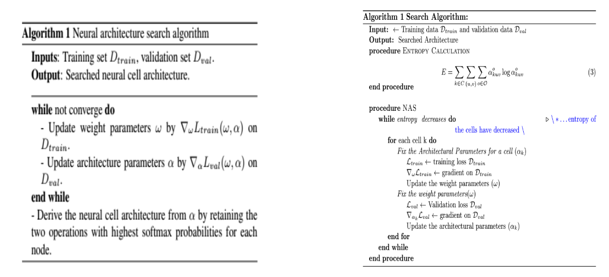
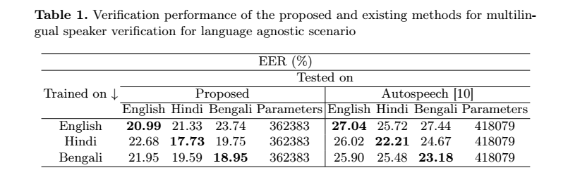
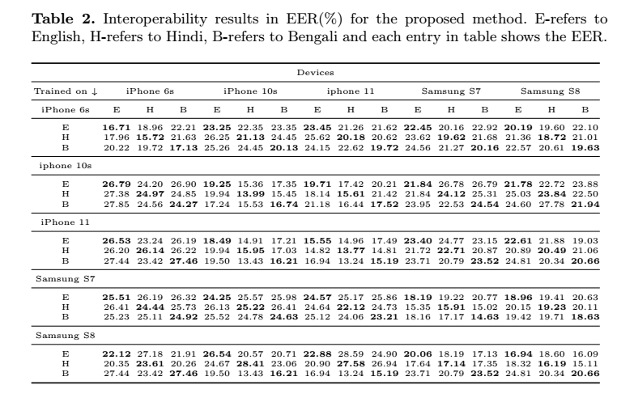
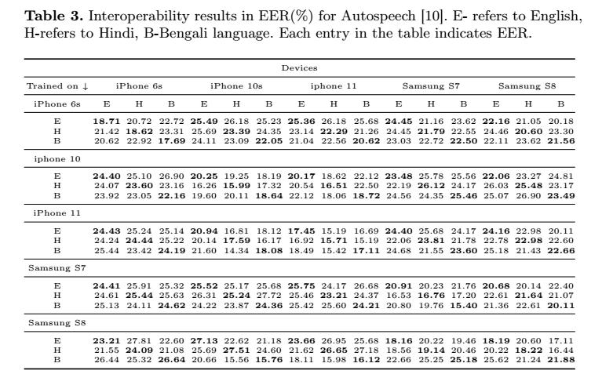
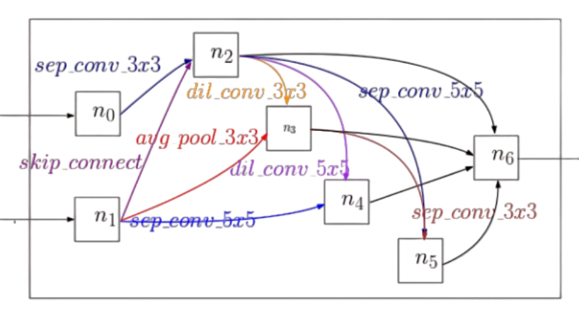
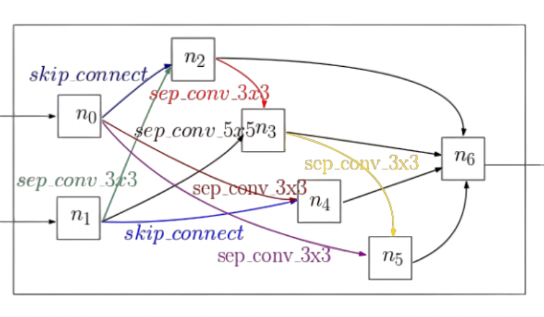

# NeuralMultiling: A Novel Neural Architecture Search for Smartphone based Multilingual Speaker Verification
## International Conference on Pattern Recognition(ICPR)-2024 [[paper]](https://arxiv.org/abs/2408.04362)
# Summary
Multilingual speaker verification introduces the challenge of verifying a speaker in multiple languages. Existing systems were built using i-vector/x-vector approaches along with Bi-LSTMs, which were trained to discriminate speakers, irrespective of the language. Instead of exploring the design space manually, we propose a neural architecture search for multilingual speaker verification suitable for mobile devices, called NeuralMultiling. First, our algorithm searches for an optimal operational combination of neural cells with different architectures for normal cells and reduction cells and then derives a CNN model by stacking neural cells. Using the derived architecture, we performed two different studies:1) language agnostic condition and 2) interoperability between languages and devices on the publicly available Multilingual Audio-Visual Smartphone (MAVS) dataset. The experimental results suggest that the derived architecture significantly outperforms the existing Autospeech method by a 5-6% reduction in the Equal Error Rate (EER) with fewer model parameters.

# Spawning different architectures for Normal and Reduction cells using Proposed algorithm

  
  
<em> Left: Algorithm of Autospeech which spawns same architecture for Normal and Reduction cell Right: Algorithm for the proposed NeuralMultiling which spwans different architecture for Normal and Reduction cell</em>

# Requirements
  Python=3.9  
Pytorch>=1.0  
Other Requirements=pip install -r requirements

## Dataset
You will need Multilingual Audio-Visual Smartphone (MAVS) database. 

## Running the code
- dataprocess:  
    python data_preprocess.py /path/to/MAVS
The output folder should be : 
- feature  
  -dev  
  -test
- Training and evaluating ResNet-18, ResNet-34 baselines:  
      python train_baseline_verification.py --cfg exps/baseline/resnet18_veri.yaml  
      python train_baseline_verification.py --cfg exps/baseline/resnet34_veri.yaml
## Architecture Search
  python search.py --cfg exps/search.yaml
## Training from scratch for verification:
  python train_verification.py --cfg exps/scratch/scratch.yaml --text_arch GENOTYPE

## Evaluation
- Verification: 
    python evaluate_verification.py --cfg exps/scratch/scratch_veri.yaml --load_path /path/to/the/trained/model

# Results 
# Language Agnostic Condition

  
  
<em> </em>

# Interoperability between Languages and Devices

  
  
<em> </em>

  
  
<em> </em>

# Visualisation of derieved architectures for Normal and Reduction cell.

  <table>
    <tr>
      <td style="text-align:center">
        
         
        <em>Normal cell</em>
      </td>
      <td style="text-align:center">
        
         
        <em>Reduction cell</em>
      </td>
    </tr>
  </table>

# Access to MAVS database
 For MAVS database send request to aravindareddy.27@gmail.com  
 Note: Database will be shared only for research and academic purpose.

# Checkpoint coming soon
- searched architecture
[Download .pt file](https://indianinstituteofscience-my.sharepoint.com/:u:/g/personal/aravindapn_iisc_ac_in/EYPk4lV1yMFLpGgl_4NmuHEBq9ZyJrxOKfFiWPcE7nXDOg?e=VZrOTR)

- evaluation model
[Download .pt file](https://indianinstituteofscience-my.sharepoint.com/:u:/g/personal/aravindapn_iisc_ac_in/EeAGA2Uw8QtOrW0E8ut15nABiv5KgFTmllRz6RtUeM9MKw?e=XCbpXa)

